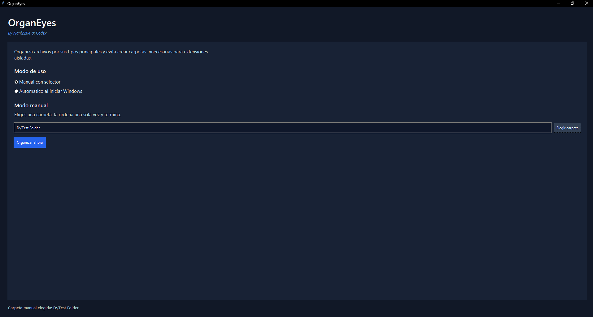
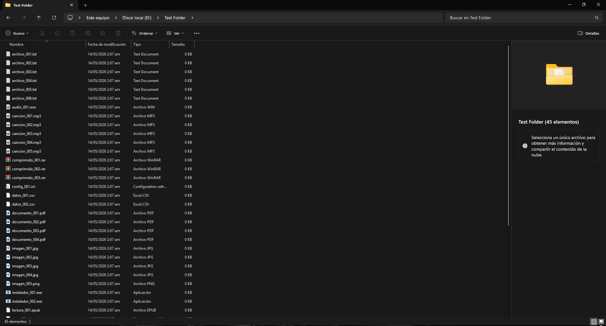
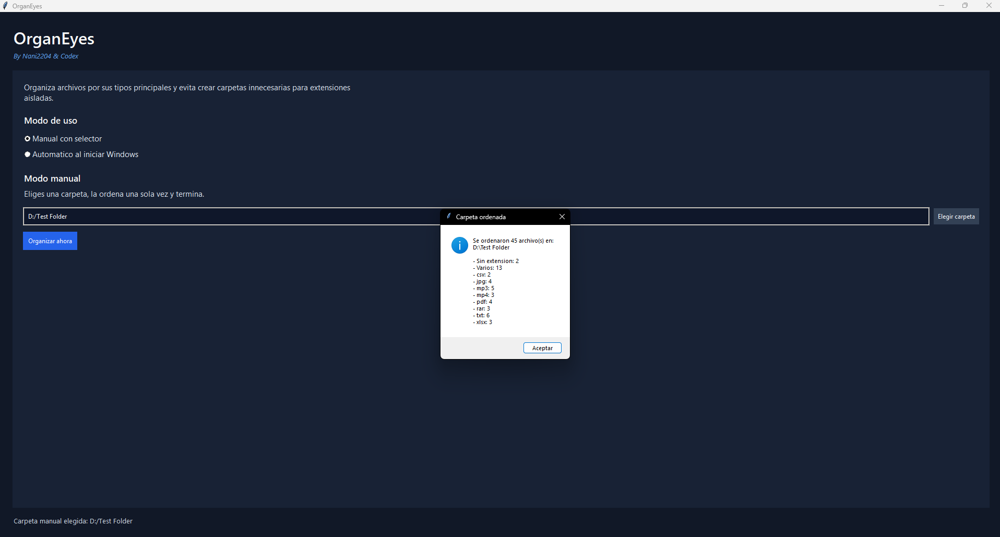
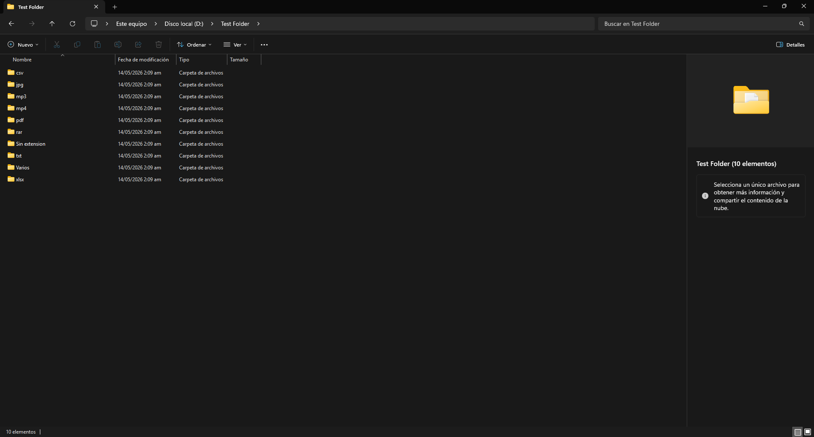
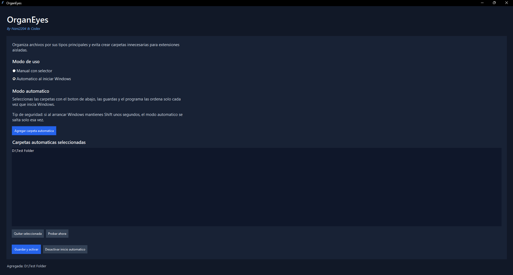

# OrganEyes

OrganEyes is a lightweight Windows desktop app that organizes files by their most common extensions.

It is designed for people who want a quick way to clean folders such as Downloads, Documents, Music, or any custom directory without installing extra dependencies.



---

## Example

### Before organizing



### Organizing process



### After organizing



---

## Automatic mode

OrganEyes can also run automatically when Windows starts.

The user chooses which folders should be organized automatically.



---

## Features

- Manual mode with folder picker
- Automatic mode that runs when Windows starts
- Smart grouping by common file extensions
- Rare extensions grouped into `Varios`
- Files without extension grouped into `Sin extension`
- Emergency skip for automatic mode by holding `Shift` during startup
- Windows notification after automatic runs
- Safe duplicate name handling
- Built only with the Python standard library

---

## How it organizes files

1. It scans only the selected folder level.
2. It counts the most common file extensions.
3. It creates dedicated folders only for the most repeated extensions.
4. Less common extensions go into `Varios`.
5. Files without extension go into `Sin extension`.
6. Name collisions are resolved safely with:
   - `file (1).ext`
   - `file (2).ext`
   - etc.

---

## Running from source

### Requirements

- Windows
- Python 3.12 or newer recommended

### Run

```powershell
python .\OrganEyes.py
```

---

## Building the executable

OrganEyes itself uses only the standard library.

To rebuild the `.exe`, install PyInstaller and run:

```powershell
python -m pip install pyinstaller
python -m PyInstaller --onefile --windowed --name OrganEyes .\OrganEyes.py
```

The generated executable will appear in:

```txt
dist\
```

---

## Automatic mode behavior

Automatic mode does not guess folders on its own.

The user must explicitly choose which folders should be organized automatically.

If no folders are configured, OrganEyes exits safely without changing anything and shows a notification.

---

## Safety notes

- OrganEyes does not recurse into subfolders
- OrganEyes does not overwrite files with the same name
- Automatic mode can be skipped for one startup session by holding `Shift` while Windows is loading the desktop

---

## Download

The latest executable version is available in the repository Releases section.

---

## Notes

This repository contains the distributable app project only.

The personal organizer script used during development is intentionally not part of this public project.

---

## Credits

Made by Nani2204 & Codex.
